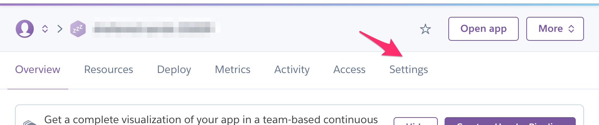
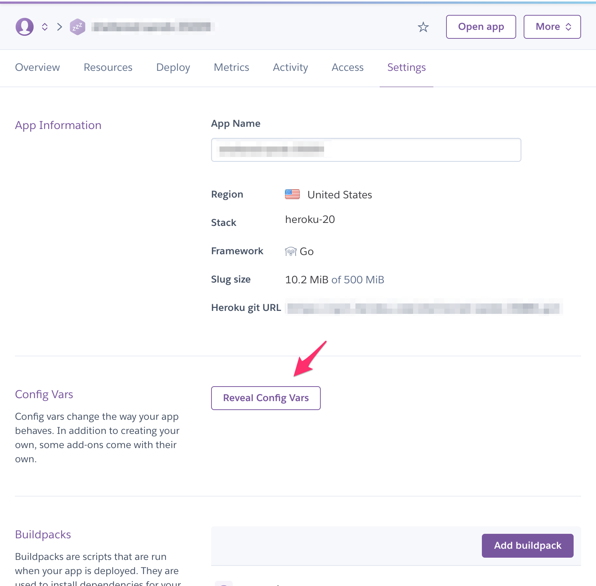

# App Builder Ban Script

Requirements: bash >= 3.2

First you need to add all the required credentials to the project. 
In the script, you can add all the config from Line 8 to Line 16. 

To get those credentials, the easiest way is to get the environment variables you have setup from your existing App Builder Backend.

If you have deployed the App Builder Backend to Heroku, here's how you can get access to your Environment Varables:

1. Open the Heroku dashboard for the App Builder Backend and click on the settings


2. Click on "Reveal Config Vars"


You can then copy and paste the relevant credentials into the script. 

## Usage:

Convert this script into an executable
```
sudo chmod +x ./kick.sh
```

Get the hash/passphrase of the room you want to close. For example, say the hash is cfc9b3ag-9egc-4ehd-91lf-23d90h5135f5, then you would do the following:

```
./kick.sh cfc9b3ag-9egc-4ehd-91lf-23d90h5135f5,
```

If everything goes well, you should get a successfull response

